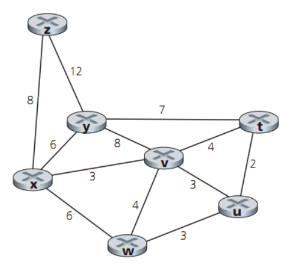

Swopnil N. Shrestha
 CS-160
 __Djikstra's Algorithm implementation__

 `(vertex, weight)` denoted as shortest path

---
Q1.  *From vertex **t** to all other vertices*

|start  |t      | u     |v      |w      |x      |y      |z      |
|---    |---    |---    |---    |---    |---    |---    |---    |
|t      |origin |`(t,2)`|(t,4)  |255    |255    |(t,7)  |255    |
|u      |*      |*      |`(t,4)`|(u,5)  |255    |(t,7)  |255    |
|v      |*      |*      |*      |`(u,5)`|(v,7)  |(t,7)  |255    |
|w      |*      |*      |*      |*      |`(v,7)`|(t,7)  |255    |
|x      |*      |*      |*      |*      |*      |`(t,7)`|(x,15) |
|y      |*      |*      |*      |*      |*      |*      |`(x, 15)`|

---
Q2. *From vertex **x** to all other vertices*

|start  |t      | u     |v      |w      |x      |y      |z      |
|---    |---    |---    |---    |---    |---    |---    |---    |
|x      |255    |255    |`(3,x)`|(x,6)  |origin |(x,6)  |(x,8)  |
|v      |(v,7)  |`(v,6)`|*      |(x,6)  |*      |(x,6)  |(x,8)  |
|u      |(v,7)  |*      |*      |`(u,6)`|*      |(x,6)  |(x,8)  |
|w      |(v,7)  |*      |*      |*      |*      |`(x,6)`|(x,8)  |
|y      |`(v,7)`|*      |*      |*      |*      |*      |(x,8)  |
|z      |*      |*      |*      |*      |*      |*      |`(x,8)`|